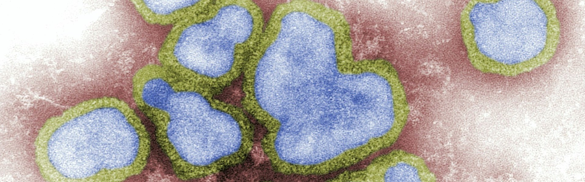

# Awesome Infectious Disease Modeling 

_A curated[^curation_details] list of awesome resources on infectious disease modeling[^definition_infectious_disease_modeling]._

[^definition_infectious_disease_modeling]: (from Wikipedia, see citation at the bottom) [Mathematical models](https://en.wikipedia.org/wiki/Mathematical_model "Mathematical model") can project how [infectious diseases](https://en.wikipedia.org/wiki/Infectious_diseases "Infectious diseases") progress to show the likely outcome of an [epidemic](https://en.wikipedia.org/wiki/Epidemic "Epidemic") (including [in plants](https://en.wikipedia.org/wiki/Plant_disease_forecasting "Plant disease forecasting")) and help inform [public health](https://en.wikipedia.org/wiki/Public_health "Public health") and plant health interventions. Models use basic assumptions or collected statistics along with mathematics to find [parameters](https://en.wikipedia.org/wiki/Parameter "Parameter") for various infectious diseases and use those parameters to calculate the effects of different interventions, like mass [vaccination](https://en.wikipedia.org/wiki/Vaccination "Vaccination") programs. The modelling can help decide which intervention(s) to avoid and which to trial, or can predict future growth patterns, etc. CITATION: Wikipedia contributors. "Mathematical modelling of infectious diseases." Wikipedia. Last modified September 30, 2025. Accessed October 24, 2025. <https://en.wikipedia.org/wiki/Mathematical_modelling_of_infectious_diseases>.

 [^image_attribution]

[^image_attribution]: Image used under the [Unsplash License](https://unsplash.com/license), i.e. "All images can be downloaded and used for free", "Commercial and non-commercial purposes", and "No permission needed (though attribution is appreciated!)". Image Link: <https://unsplash.com/photos/a-group-of-blue-and-green-cells-on-a-white-surface-VYUNnjcHyNw>. Image Description: "This digitally-colorized, negative-stained transmission electron microscopic (TEM) image depicted a number of Influenza A virions.". Image Photographer: [CDC](https://unsplash.com/@cdc).

[^curation_details]: This list follows specific scoping guidelines. **Modeling Software & Tools** covers R packages, standalone software, climate-sensitive disease tools, and machine learning tools for epidemic modeling. **Surveillance & Data Systems** includes global, US, and regional disease surveillance networks. **Epidemiological Databases** lists health data repositories from WHO and other agencies. **Organizations & Networks** features research institutes and collaborative networks. **Journals & Publications** covers peer-reviewed journals in epidemiology and disease modeling. **Educational Resources** includes online courses, textbooks, and tutorials.

## Contents

- [Modeling Software & Tools](#modeling-software--tools)
- [Surveillance & Data Systems](#surveillance--data-systems)
- [Epidemiological Databases](#epidemiological-databases)
- [Organizations & Networks](#organizations--networks)
- [Journals & Publications](#journals--publications)
- [Educational Resources](#educational-resources)
- [People](#people)
- [Related Awesome Lists](#related-awesome-lists)

## Modeling Software & Tools

### R Packages

1. [EpiModel](https://epimodel.github.io/EpiModel/): Mathematical models of infectious disease dynamics (deterministic compartmental, stochastic individual-contact, network models using ERGMs).
2. [EpiEstim](https://cran.r-project.org/package=EpiEstim): Real-time reproduction number (Rt) estimation.
3. [surveillance](https://cran.r-project.org/package=surveillance): Temporal and spatio-temporal outbreak detection.

### Standalone Software

1. [STEM (Spatiotemporal Epidemiological Modeler)](https://www.eclipse.org/stem/): Eclipse Foundation open-source platform for global disease spread modeling.
2. [EPIMOD](https://epimod.org): Agent-based modeling framework.
3. [OpenMalaria](https://github.com/SwissTPH/openmalaria): Microsimulation model of malaria epidemiology and control.
4. [GLEAM (Global Epidemic and Mobility Model)](http://www.gleamviz.org): Large-scale epidemic modeling with human mobility data.

### Climate-Sensitive Disease Tools

Per _The Lancet Planetary Health_ (2023), 37 validated tools model climate-sensitive infectious diseases:

- **VECTRI**: Vector-borne disease community model (malaria).
- **DyMSiM**: Dynamic Mosquito Simulation Model (dengue, West Nile virus).
- **HYDREMATS**: Hydrology, Entomology, and Malaria Transmission Simulator.
- **ArboMAP**: Arbovirus mapping and prediction (West Nile virus).
- **BODA**: Bayesian Outbreak Detection Algorithm (campylobacteriosis).

### Machine Learning Tools

1. [EPIDEMIA](https://github.com/ImperialCollegeLondon/epidemia): Bayesian hierarchical models for epidemic data.
2. [Metaculus COVID-19 Models](https://www.metaculus.com/questions/covid-19/): Community forecasting platform.

## Surveillance & Data Systems

### Global Systems

1. [WHO Global Outbreak Alert and Response Network (GOARN)](https://www.who.int/emergencies/goarn): International outbreak response coordination.
2. [WHO Global Influenza Surveillance and Response System (GISRS)](https://www.who.int/initiatives/global-influenza-surveillance-and-response-system): Influenza virus tracking for vaccine development.
3. [WHO Global Antimicrobial Resistance Surveillance System (GLASS)](https://www.who.int/initiatives/glass): AMR data collection and analysis.
4. [HealthMap](https://www.healthmap.org): Automated disease outbreak monitoring from online sources.
5. [ProMED-mail](https://promedmail.org): Internet-based disease outbreak reporting system.
6. [GPHIN (Global Public Health Intelligence Network)](https://gphin.canada.ca): WHO-partnered early warning system scanning web sources.

### United States

1. [CDC National Notifiable Diseases Surveillance System (NNDSS)](https://www.cdc.gov/nndss/about/index.html): U.S. disease case surveillance from all states.
2. [CDC WONDER](https://wonder.cdc.gov): Public health data query system (mortality, natality, cancer, TB, vaccinations).
3. [FluView](https://www.cdc.gov/flu/weekly/): CDC weekly influenza surveillance reports.
4. [COVID-19 Forecast Hub](https://covid19forecasthub.org): Ensemble forecasts from multiple modeling teams.

### Regional Networks

1. [CORDS (Connecting Organisations for Regional Disease Surveillance)](https://www.cordsnetwork.org): Six regional networks in 28 countries (Africa, Asia, Middle East, Europe).

## Epidemiological Databases

1. [WHO Global Health Observatory (GHO)](https://www.who.int/data/gho): 1,000+ health topics indicators across 194 WHO Member States.
2. [WHO Data Collections](https://www.who.int/data/collections): Disease-specific data (TB, HIV, malaria, NCDs).
3. [CDC Surveillance Systems](https://www.cdc.gov/surveillance/surveillance-systems/index.html): Multiple disease-specific surveillance networks.
4. [European CDC Surveillance Portal](https://www.ecdc.europa.eu/en/surveillance-and-disease-data): EU/EEA communicable disease data.

## Organizations & Networks

1. [Institute for Disease Modeling (IDM)](https://www.idmod.org): Bill & Melinda Gates Foundation research institute developing freely available modeling tools.
2. [MIDAS (Models of Infectious Disease Agent Study)](https://midasnetwork.us): NIH-funded network of researchers, software, and data.
3. [CEID (Center for Infectious Disease Dynamics)](https://www.huck.psu.edu/institutes-and-centers/center-for-infectious-disease-dynamics): Penn State research center.
4. [Task Force for Global Health - Disease Surveillance](https://www.taskforce.org/disease-surveillance/): SONAR program strengthening outbreak notification in LMICs.

## Journals & Publications

1. [PLOS Computational Biology](https://journals.plos.org/ploscompbiol/): Open access, includes disease modeling papers.
2. [Epidemics](https://www.sciencedirect.com/journal/epidemics): Elsevier journal focused on infectious disease dynamics.
3. [Journal of Theoretical Biology](https://www.sciencedirect.com/journal/journal-of-theoretical-biology): Mathematical biology including epidemiology.
4. [Eurosurveillance](https://www.eurosurveillance.org): European CDC journal on communicable disease epidemiology and control.
5. [Emerging Infectious Diseases](https://wwwnc.cdc.gov/eid/): CDC monthly open-access journal.
6. [The Lancet Infectious Diseases](https://www.thelancet.com/journals/laninf/home): High-impact clinical and public health research.

## Educational Resources

### Online Courses

1. [Coursera Epidemiology Specialization](https://www.coursera.org/specializations/epidemiology): University of North Carolina at Chapel Hill.
2. [Johns Hopkins Epidemiology in Public Health Practice](https://www.coursera.org/specializations/epidemic-models): Modeling infectious diseases specialization.
3. [Imperial College London Infectious Disease Modeling](https://www.imperial.ac.uk/mrc-global-infectious-disease-analysis/training/): Short courses and workshops.

### Textbooks & Guides

1. _Modeling Infectious Diseases in Humans and Animals_ by Keeling & Rohani (2008): Standard textbook.
2. _Mathematical Models in Epidemiology_ by Brauer, Castillo-Chavez & Feng (2019).
3. _An Introduction to Infectious Disease Modelling_ by Vynnycky & White (2010).

### Tutorials

1. [EpiModel Tutorials](https://epimodel.org/tut.html): Step-by-step R package tutorials.
2. [STEM Documentation](https://wiki.eclipse.org/STEM): Spatiotemporal Epidemiological Modeler guides.

## People

- [Samuel Jenness](https://github.com/smjenness) - Emory University. Creator and lead developer of the EpiModel R package for network-based infectious disease modeling.
- [Sam Abbott](https://github.com/seabbs) - Epiforecasts. Developer of EpiNow2 for real-time Rt estimation and nowcasting, widely used during COVID-19.
- [Sebastian Funk](https://github.com/sbfnk) - London School of Hygiene & Tropical Medicine. Leads the Epiforecasts group, develops statistical and mechanistic models for infectious disease forecasting.
- [Nicholas Reich](https://github.com/nickreich) - UMass Amherst. Leads the US COVID-19 Forecast Hub and CDC FluSight influenza forecasting initiative.
- [Adam Kucharski](https://github.com/adamkucharski) - London School of Hygiene & Tropical Medicine. Author of "The Rules of Contagion." Key figure in early COVID-19 R0 estimation.
- [Simon Frost](https://github.com/sdwfrost) - Microsoft Health Futures / LSHTM. Creator of the epirecipes project, a multilanguage cookbook of infectious disease transmission models.
- [Christian Althaus](https://github.com/calthaus) - University of Bern. Develops rapid, open-source outbreak analysis models for emerging epidemics.

## Related Awesome Lists

- [Awesome Healthcare](https://github.com/kakoni/awesome-healthcare) - Open source healthcare software, libraries, tools, and resources.
- [Awesome Computational Biology](https://github.com/inoue0426/awesome-computational-biology) - Computational biology resources.
- [Awesome Parasite](https://github.com/ecohealthalliance/awesome-parasite) - Host-parasite information and resources.
- [Awesome Bioinformatics](https://github.com/danielecook/Awesome-Bioinformatics) - Bioinformatics libraries and software.

## Contributing

Notice anything missing that would be a good fit? If interested in contributing, please see the [contributing file](./CONTRIBUTING.md) for further direction.

## Code of Conduct

Please see the [code of conduct](./CODE_OF_CONDUCT.md).

## License

To the extent possible under law, [O957](https://github.com/O957) has waived all copyright and related or neighboring rights to this work.
